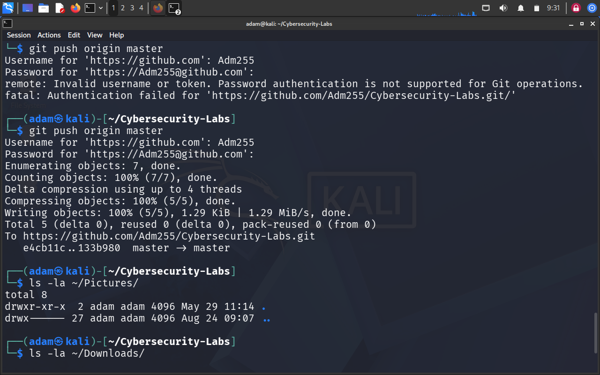

# 🛡️ Cybersecurity Labs - Adam Annour Idriss

## 👋 About Me
Cybersecurity student at **Adventist University of Central Africa (AUCA)**.  
**SOLVIT Code2Connect Fellow** (Cybersecurity Track).

🎯 **Goal:** Securing an entry-level cybersecurity role.

---

## 🏆 Completed Exploits

| Exploit | Date | Access | Tech Stack |
|---------|------|--------|------------|
| **Samba Usermap Script (CVE-2007-2447)** | Aug 2026 | Root | Metasploit, SMB |
| **vsftpd 2.3.4 Backdoor** | Aug 2026 | Root | Metasploit, FTP |

---

## 🔄 In Progress
- [ ] PostgreSQL Default Credentials
- [ ] UnrealIRCd Backdoor
- [ ] Tomcat Manager Deploy
- [ ] Windows XP (MS17-010)

---

## 🛠️ Tools I Use

| Category | Tools |
|----------|-------|
| **Pentesting** | Metasploit, Nmap, Netdiscover |
| **Web Security** | Burp Suite, Nikto, SQLmap |
| **Password Cracking** | John the Ripper, Hashcat |
| **Operating Systems** | Kali Linux, Ubuntu, Windows |

---

## 📁 Repository Structure

```
Cybersecurity-Labs/
├── exploits/          # Step-by-step exploit guides
├── reports/           # Professional pentest reports
├── screenshots/       # Proof of concepts
├── scripts/           # Custom automation scripts
└── notes/             # Learning resources
```

---

## 📸 Proof of Concepts



---

## 🔗 Connect With Me

- **GitHub:** [Adm255](https://github.com/Adm255)
- **LinkedIn:** [Adam Annour Idriss](https://www.linkedin.com/in/adam-annour-idriss)
- **Email:** adamannourannouridriss@gmail.com

---

## 📌 Future Plans
- [ ] Complete 5 exploits on Metasploitable 2
- [ ] Complete 10 Hack The Box machines
- [ ] Build custom pentesting scripts in Python
- [ ] Earn CompTIA Security+ certification

---

> *"The best defense is a good offense."*

*Last Updated: August 2026*
